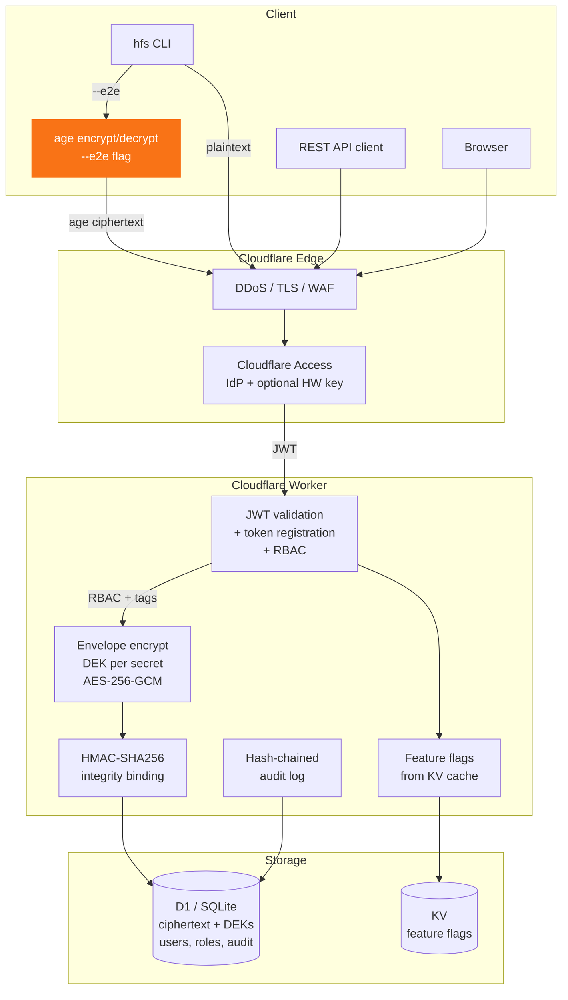

# Secret Vault

Self-hosted encrypted secret manager on Cloudflare Workers. No external dependencies, no third-party trust - runs entirely on your own account.

[](https://developers.cloudflare.com/workers/)
[](https://hono.dev/)
[](https://www.typescriptlang.org/)
[](https://www.openapis.org/)
[](LICENSE)

Store API keys, tokens, certificates, and credentials with a CLI or REST API. Every secret is envelope-encrypted with its own key, integrity-bound via HMAC, and access-controlled through role-based permissions with tag-level restrictions. Every operation is audit-logged in a tamper-evident hash chain.

## Why

- **Zero trust in third parties** - your secrets never leave your Cloudflare account
- **Defense in depth** - Cloudflare Access at the edge, Worker-level JWT validation, registered token enforcement, RBAC with per-secret tag restrictions
- **Encryption done right** - envelope encryption (per-secret DEK + master KEK), HMAC integrity binding, optional separate integrity key
- **Operational control** - 24 runtime feature flags, version history with restore, secret expiry tracking, user management - all without redeploying

## Security

| Layer | What |
|-------|------|
| **E2E encryption** | Optional zero-knowledge mode with [age](https://age-encryption.org/). Secrets encrypted on your machine before they reach the server. Multi-recipient support. |
| **Envelope encryption** | AES-256-GCM - each secret gets its own DEK, wrapped by a master KEK. Key rotation via DEK re-wrapping. |
| **Integrity** | HMAC-SHA256 binds each secret to its key name. Separate `INTEGRITY_KEY` for key separation. Tamper-evident at rest. |
| **Zero Trust** | Native Cloudflare WARP integration with challenge-response device verification, ZT cert binding, and Gateway-policeable CLI. |
| **Auth** | Dual-path via Cloudflare Access: interactive (IdP + optional hardware keys) or registered service tokens. |
| **RBAC** | Users and tokens assigned to roles (admin, operator, reader, custom). Tag-based restrictions limit which secrets a role can access. |
| **Audit** | Every operation logged with identity, IP, user agent, request ID. SHA-256 hash-chained for tamper detection. |
| **Lifecycle** | Version history with restore, expiry enforcement, burn-after-reading, 24 feature flags for runtime control. |

Deep dive: [Encryption Architecture](docs/encryption.md) | [Threat Model](SECURITY.md) | [Feature Flags](docs/feature-flags.md) | [WARP / Zero Trust](docs/cloudflare-warp.md)

## Architecture



See [Encryption Architecture](docs/encryption.md) for detailed diagrams of envelope encryption, HMAC binding, e2e modes, team lifecycle, and key rotation.
```

## Packages

| Package | What | Docs |
|---------|------|------|
| [`secret-vault/`](secret-vault/) | Cloudflare Worker API | [README](secret-vault/README.md) |
| [`hfs/`](hfs/) | CLI for humans and scripts | [README](hfs/README.md) |

## Quick start

**1. Deploy the Worker** - see [secret-vault/README.md](secret-vault/README.md)

**2. Install the CLI and connect**

```bash
npm install -g @FlarelyLegal/hfs-cli --registry=https://npm.pkg.github.com
hfs config set --url https://secrets.yourcompany.com
hfs login
```

**3. Use it**

```bash
hfs set api-key sk-ant-... -t production    # store with tags
hfs get api-key -q                          # retrieve (pipe-friendly)
hfs ls                                      # list keys
eval $(hfs env -e API_KEY DB_PASSWORD)      # load into shell

# Zero-knowledge mode - server can't read these
hfs keygen --register                       # one-time: generate + register age key
hfs set db-password "hunter2" --private     # encrypted for only you
hfs set shared-key "val" --e2e -t prod      # encrypted for all eligible team members
hfs get db-password -q                      # decrypted on your machine
hfs rewrap --all                            # re-encrypt after team changes

# Admin
hfs user add ops@company.com -r operator    # add a user
hfs role set ci-reader read --allowed-tags ci  # tag-restricted role
hfs token register abc.access -n ci -r ci-reader  # scoped service token
hfs audit --action set --from 2026-03-01    # filtered audit log

# Secret expiration
hfs set api-key sk-ant-... --ttl 90d       # store with 90-day TTL
hfs expiring                               # list soon-expiring secrets

# References and interpolation
hfs get db-url --resolve                   # resolve ${HOST}:${PORT} references

# Environment profiles
hfs profile env production -e             # load all production secrets

# Dependency mapping
hfs audit consumers API_KEY               # who accessed this secret?
```

## Development

```bash
npm run lint                    # Biome check
cd secret-vault && npm test     # 48 Worker tests
cd hfs && npm test              # 38 CLI tests (86 total)
```

## OpenAPI

API spec auto-generated at `/doc` from Zod schemas. Interactive Scalar UI. Every endpoint is validated and documented.

## Changelog

Generated from commits via [git-cliff](https://git-cliff.org/): `npm run changelog`
