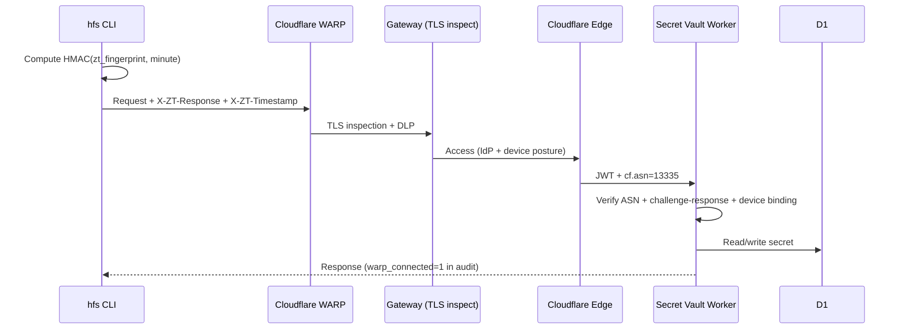

# Cloudflare WARP Integration

How Secret Vault integrates with Cloudflare WARP and Zero Trust for enterprise-grade device security.

## Overview



Three verification layers when `require_warp` is enabled:

1. **ASN check** — traffic routed through Cloudflare's network (ASN 13335)
2. **Challenge-response** — CLI proves possession of the org's ZT CA cert via time-based HMAC
3. **Device binding** — user's registered ZT fingerprint must match the org's cert

## How Challenge-Response Works

The CLI and Worker share knowledge of the org's ZT CA certificate fingerprint. On every request:

1. CLI computes `HMAC-SHA256(zt_ca_fingerprint, current_unix_minute)`
2. Sends as `X-ZT-Response` + `X-ZT-Timestamp` headers
3. Worker recomputes using stored `ZT_CA_FINGERPRINT` secret + the timestamp
4. Constant-time comparison — rejects if mismatched
5. 2-minute staleness window with 1-minute clock skew tolerance

This is stateless (no nonce exchange), adds zero latency (no extra round-trip), and prevents replay (timestamp-bound).

## How Device Binding Works

When a user registers their encryption key:

```bash
hfs keygen --register
```

The CLI automatically computes the SHA-256 fingerprint of the locally installed ZT CA cert and stores it on the user record. On every subsequent request, the Worker verifies the user's registered fingerprint matches the org's `ZT_CA_FINGERPRINT`.

If someone steals a JWT or age key, they still need a device with the org's ZT cert installed to access secrets.

## Setup

### 1. Store the org's ZT CA fingerprint

```bash
# Get your org's ZT CA fingerprint
openssl x509 -in "/Library/Application Support/Cloudflare/installed_cert.pem" \
  -noout -fingerprint -sha256

# Store as Worker secret (lowercase hex, no colons)
echo -n "746da12f..." | wrangler secret put ZT_CA_FINGERPRINT
```

### 2. Register each user's device

Each team member runs:

```bash
hfs keygen --register
# Automatically records ZT fingerprint alongside age public key
```

### 3. Enable enforcement

```bash
hfs flag set require_warp true
```

## CLI Auto-Detection

The CLI automatically finds the WARP CA certificate:

| Platform | Path |
|----------|------|
| macOS | `/Library/Application Support/Cloudflare/installed_cert.pem` |
| Linux | `/usr/local/share/ca-certificates/Cloudflare_CA.crt` |

Manual override:
```bash
hfs config set --ca-cert /path/to/cert.pem   # persistent
export HFS_CA_CERT=/path/to/cert.pem         # per-session
```

Check status:
```bash
hfs config show
# TLS
#   ca cert:   /Library/Application Support/Cloudflare/installed_cert.pem (auto-detected)
```

## Gateway Policy Control

The CLI sends a standards-compliant User-Agent header on every request:

```
hfs-cli/0.22.0 (darwin; arm64) node/25.8.2
```

Gateway admins can use this to allow or block the CLI at the network level:

- **Allow**: HTTP policy matching `User-Agent` contains `hfs-cli` → Allow
- **Block**: HTTP policy matching `User-Agent` contains `hfs-cli` → Block
- **Audit**: HTTP policy → Log all `hfs-cli` traffic for compliance

This means companies control whether Secret Vault is used on their network — no coordination with the vault operator needed. Standard Cloudflare Gateway policy.

## E2E Encryption + WARP

WARP and E2E encryption are independent layers:

| Layer | Protects | Where |
|-------|----------|-------|
| **WARP + Gateway** | Transport — TLS inspection, DLP | Network |
| **Challenge-response** | Device identity — org cert possession | Headers |
| **E2E (age)** | Content — server never sees plaintext | Client-side |
| **Envelope** | Storage — per-secret DEK + master KEK | Server-side |

With `--e2e` or `--private`, even Gateway TLS inspection only sees age ciphertext.

## Troubleshooting

### "WARP enrollment required"

The `require_warp` flag is on but no WARP signals detected. Enable WARP on your device.

### "ZT challenge-response missing"

The CLI didn't find a ZT CA cert. Check `hfs config show` for TLS status.

### "ZT challenge-response invalid"

The cert fingerprint doesn't match the stored `ZT_CA_FINGERPRINT` secret, or the timestamp is stale (>2 minutes). Ensure the secret is lowercase hex with no colons.

### "device fingerprint mismatch"

The user registered with a different ZT cert than the org's. Re-register: `hfs keygen --register`
