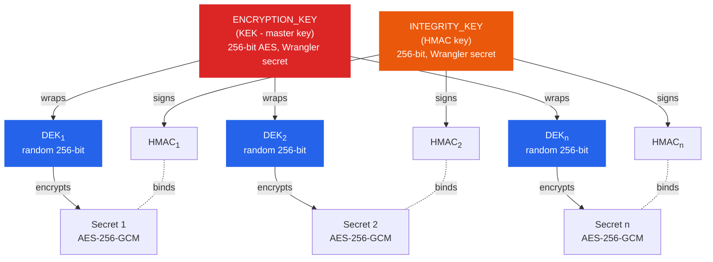
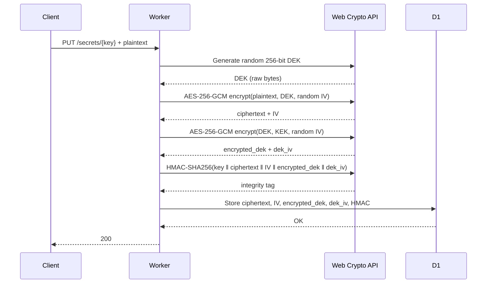
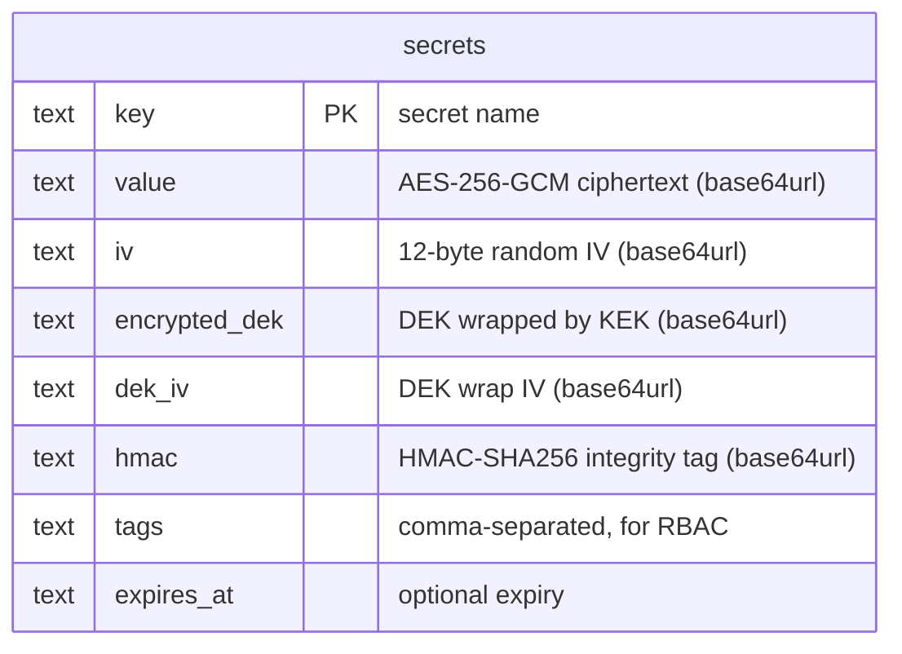
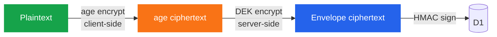
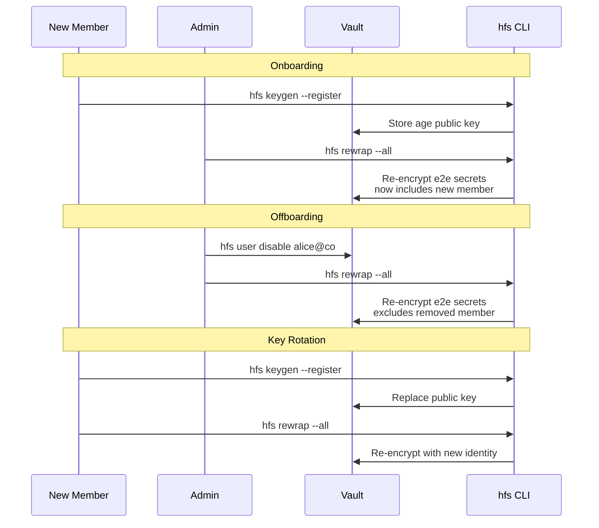
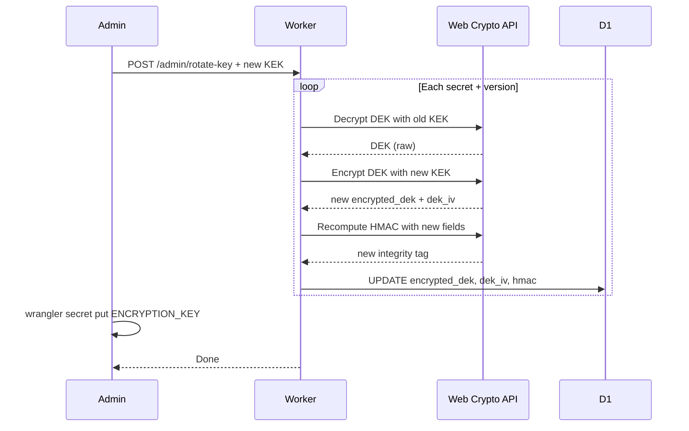
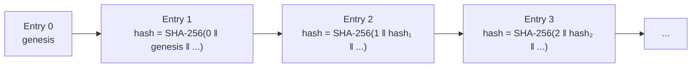

# Encryption Architecture

How Secret Vault encrypts, authenticates, and protects secrets at rest and in transit.

## Key Hierarchy



Each secret gets its own random DEK. Compromising one DEK exposes one secret, not the vault. The KEK never touches secret data directly.

## Envelope Encryption

Every write follows this flow:



Decryption reverses the process: verify HMAC, unwrap DEK with KEK, decrypt ciphertext with DEK.

## What Gets Stored



The database only stores ciphertext. The KEK and INTEGRITY_KEY exist only as Wrangler secrets, available at Worker runtime.

## HMAC Integrity Binding

The HMAC binds all encrypted fields together and to the secret's key name:

```
HMAC-SHA256(INTEGRITY_KEY, key ‖ ":" ‖ ciphertext ‖ ":" ‖ IV ‖ ":" ‖ encrypted_dek ‖ ":" ‖ dek_iv)
```

This detects:
- Ciphertext tampering (modified value in D1)
- DEK swap attacks (replacing encrypted_dek with one from another secret)
- Key name rebinding (copying a row to a different key)

## End-to-End Encryption (age)

For zero-knowledge secrets, an additional client-side layer wraps the plaintext before it reaches the server:



| Mode | Flag | Who can decrypt | Use for |
|------|------|-----------------|---------|
| Standard | (default) | Anyone with vault access + KEK | Shared infra secrets where server trust is acceptable |
| Private | `--private` | Only the key owner (single age recipient) | Personal tokens, credentials only you need |
| Team E2E | `--e2e` | All RBAC-eligible team members | Shared secrets where the server must not see plaintext |
| Explicit | `--recipients <keys>` | Specific age public keys you list | Cross-team sharing with explicit control |

The server stores age ciphertext as the "plaintext" input to envelope encryption. A compromised Worker or database sees only the age blob. Decryption requires the recipient's age private key.

### Team Lifecycle



- **Join**: new member runs `keygen --register`, then anyone runs `rewrap --all` to include them
- **Leave**: admin disables the user, then `rewrap --all` to exclude their key
- **Rotate**: member runs `keygen --register` (replaces their public key), then `rewrap --all`

After `rewrap`, the old key can no longer decrypt any e2e secrets. The `--private` secrets are single-recipient - only the owner can rewrap those.

## Key Rotation

Each layer rotates independently. Secret data is never re-encrypted - only wrapping or signing keys change.

### Master key (ENCRYPTION_KEY)

Re-wraps every DEK with a new KEK. Ciphertext is untouched.



```bash
hfs re-encrypt                            # ensure envelope encryption
npm run generate-keys                     # generate new 256-bit key
hfs rotate-key <new-64-char-hex-key>      # re-wrap all DEKs
wrangler secret put ENCRYPTION_KEY        # update Wrangler secret
hfs health && hfs get <any-secret> -q     # verify
```

### Integrity key (INTEGRITY_KEY)

Recomputes all HMACs. Export, delete, and re-import secrets after updating the Wrangler secret.

```bash
openssl rand -hex 32                      # generate new key
wrangler secret put INTEGRITY_KEY         # update Wrangler secret
# redeploy, then re-save all secrets to recompute HMACs
```

### Age identity (e2e key)

Generates a new age keypair and re-encrypts all e2e secrets for the new identity.

```bash
hfs keygen --register                     # new identity, registers public key
hfs rewrap --all                          # re-encrypt all e2e secrets
```

The old identity can no longer decrypt anything after rewrap.

## Audit Hash Chain

Every operation produces a tamper-evident audit entry linked to the previous one:



Each entry's hash includes:
```
SHA-256(prev_id ‖ prev_hash ‖ timestamp ‖ method ‖ identity ‖ action ‖ secret_key)
```

Modifying or deleting any entry breaks the chain. Verify with `hfs audit-verify`.

Under concurrent inserts, the chain self-heals: if a race condition causes an entry to hash against the wrong predecessor, it detects the mismatch and recomputes.

## Algorithms Summary

| Purpose | Algorithm | Key size | Notes |
|---------|-----------|----------|-------|
| Secret encryption | AES-256-GCM | 256-bit DEK | Per-secret random IV (96-bit) |
| DEK wrapping | AES-256-GCM | 256-bit KEK | Per-wrap random IV |
| Integrity binding | HMAC-SHA256 | 256-bit | Separate INTEGRITY_KEY recommended |
| ZT challenge-response | HMAC-SHA256 | ZT CA fingerprint | Time-based, replay-protected |
| Audit chain | SHA-256 | - | Hash-linked, self-healing, includes timestamp |
| E2E encryption | X25519 + ChaCha20-Poly1305 | via [age](https://age-encryption.org/) | Client-side only |
| Auth tokens | ES256 (P-256) | via Cloudflare Access JWKS | Edge + Worker validation |

All server-side crypto uses the Web Crypto API (`crypto.subtle`), built into the Cloudflare Workers runtime. No third-party crypto libraries.

See [Cloudflare WARP Integration](cloudflare-warp.md) for ZT device binding and challenge-response details.
